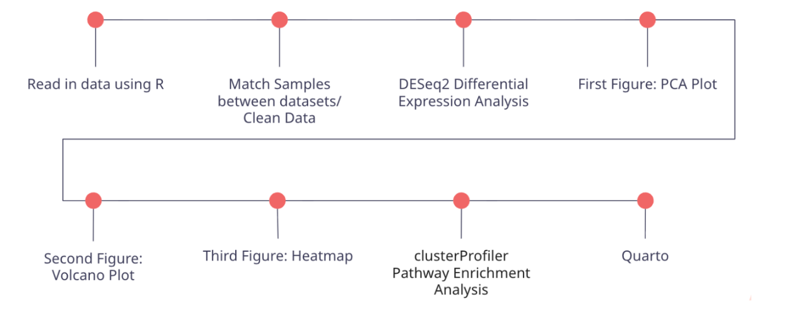

## Methods Pipeline

### Data 
RNA-sequencing data were obtained from the publicly available dataset GSE135251, originally published in Transcriptomic signatures of fibrosis progression in nonalcoholic fatty liver disease. The dataset includes liver biopsy samples spanning multiple stages of Nonalcoholic Fatty Liver Disease progression. In the original study, fibrosis was categorized into five stages (F0–F4). For this analysis, fibrosis stages were consolidated into three biologically meaningful groups to improve statistical power and simplify interpretation:
Control (F0): no fibrosis (n = 8)
Early fibrosis (F1–F2): mild disease (n = 138)
Moderate/advanced fibrosis (F3–F4): severe disease (n = 68)
This increased the sample size within each category and allowed for a better detection of gene expression differences associated with fibrosis progression.

### Matched Samples/ Cleaning 
Raw RNA-seq count data were imported into R and processed using standard workflows. Sample metadata were matched to expression data to ensure correct alignment of fibrosis stage labels with sequencing samples.In addition to regrouping fibrosis stages into three categories (control, early, and moderate), we refined the dataset by excluding samples that lacked clear fibrosis stage annotations or had incomplete metadata, and we standardized gene identifiers to ensure compatibility with downstream enrichment tools. This step ensured consistency between expression data and clinical grouping while maintaining data quality.

### Differential Expression Analysis
Differential gene expression analysis was performed using DESeq2, a method specifically designed for count-based RNA-seq data. DESeq2 models count data using a negative binomial distribution and apply normalization to account for sequencing depth and dispersion. Comparisons were conducted between fibrosis groups to identify genes whose expression changes with disease progression. Genes with statistically significant adjusted p-values were considered differentially expressed.

### Visualization and Data 
To assess data structure and results, multiple visualization techniques were used:
- Principal Component Analysis (PCA) to evaluate sample clustering by fibrosis stage
- Volcano plots to display significance versus magnitude of gene expression changes
- Heatmaps to visualize expression patterns of key genes across samples
These visualizations supported interpretation of both global transcriptomic variation and pathway-specific trends.

## Pathway Enrichment Analysis

To interpret gene-level changes in a biological context, pathway enrichment analysis was performed using clusterProfiler. This tool identifies overrepresented biological pathways among differentially expressed genes. Analyses focused on pathways relevant to NAFLD progression, including extracellular matrix (ECM) organization, inflammation, lipid metabolism, and insulin resistance.

