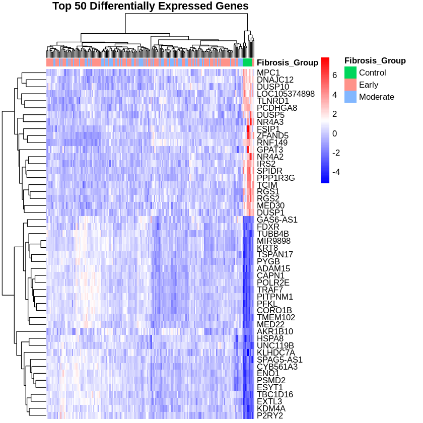
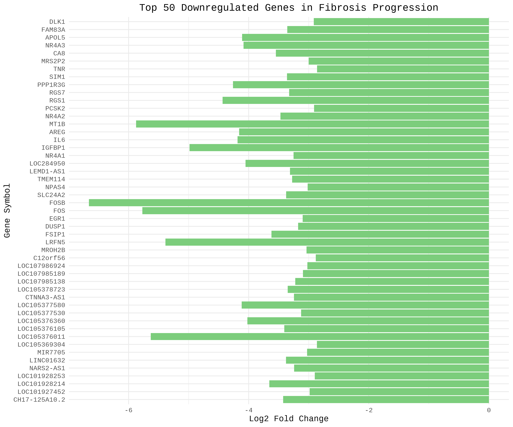
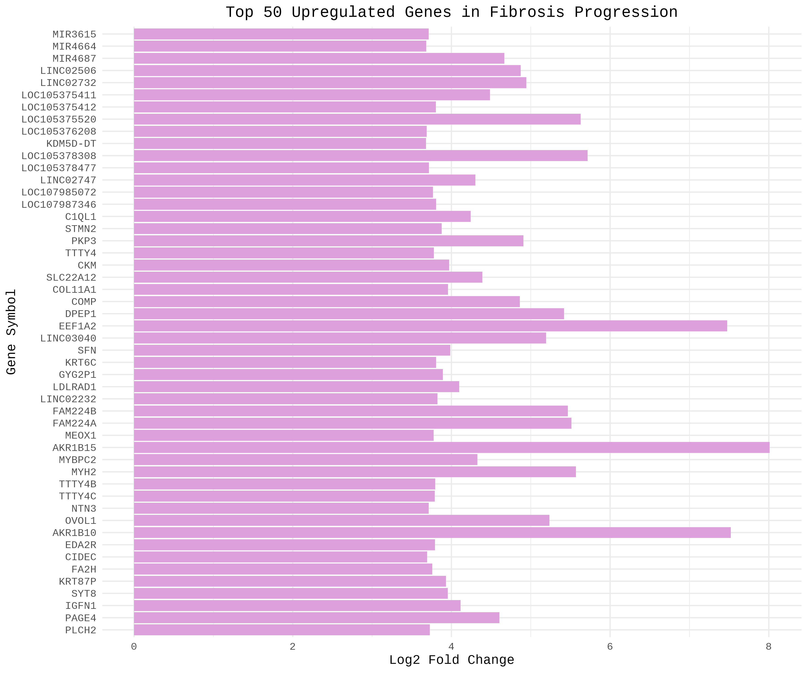

## Key findings (draft)
Add bullet points as you go.

## Figures
Add figures as you generate them. Example:








```{r}
# If using R, put code here (optional)

# If using Python, put code here (optional)

